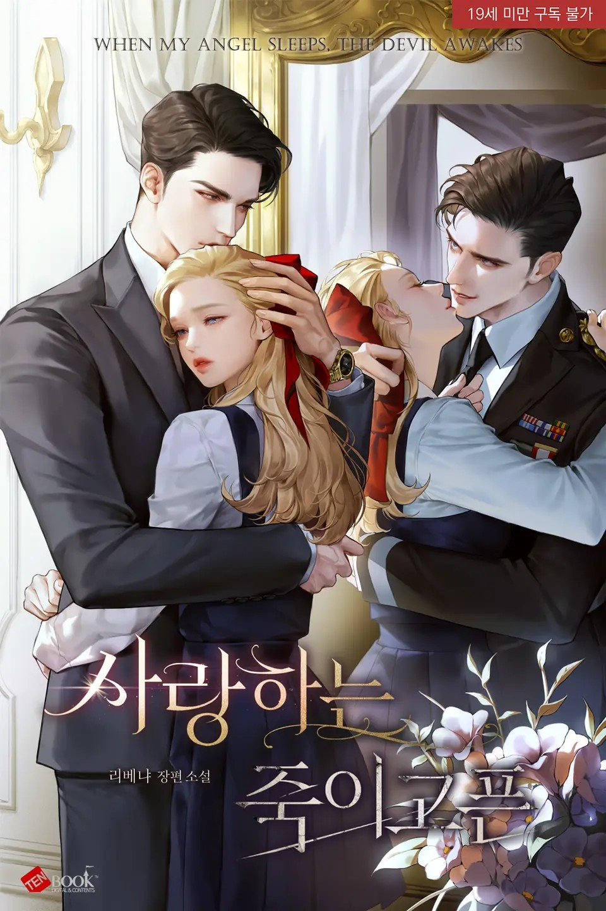

<!-- Dynamic Title Effect (Imperial, Cinzel font, Gold color, Smooth transition) -->

  
   

<!-- Left-aligned content starts here, giving a structured feel -->

<!-- Synopsis / Hook -->

Credits:

Another masterpiece written by [Libenia](https://x.com/_libenia_)

Source Translation: Spanish version taken from [Asurenovels](https://asurenovels.website)

Translated using Gemini and edited for immersive audiobook vibes by the me.

